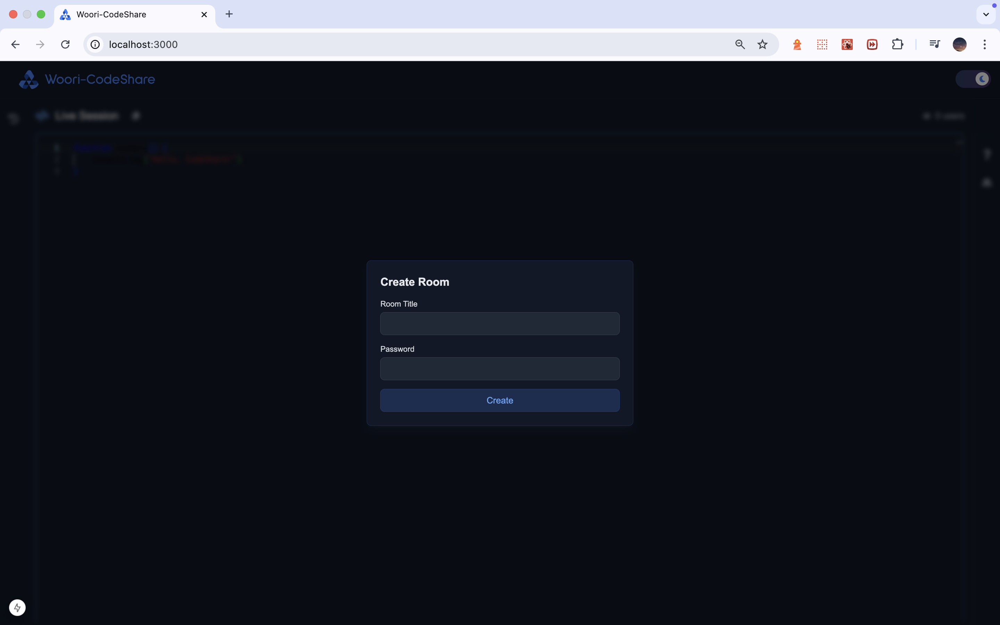
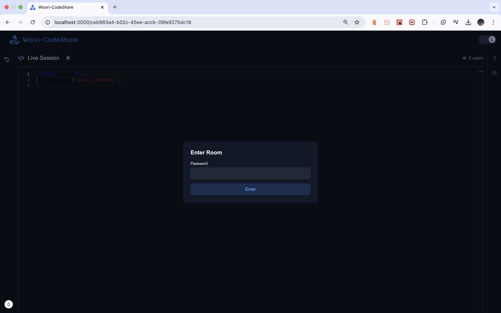
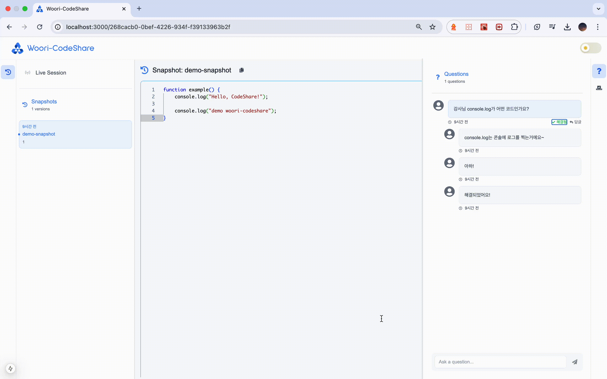

# Woori-CodeShare

Woori-CodeShare는 강사님의 코드를 실시간으로 공유하고, 스냅샷하여 우리에프아이에스 아카데미 수강생들의 보다 더 나은 수업을 위해 기획된 프로젝트에요.

## 주요 기능

1. 사용자는 방을 생성하거나, 기존 방에 참여할 수 있어요.

   

   

2. 방에 참여한 사용자는 강사님의 코드를 실시간으로 공유받을 수 있어요.

   
   [youtube](https://youtu.be/xZoLT4L6aOQ)

3. 사용자는 코드를 스냅샷하여, 나중에 다시 볼 수 있어요.

   
   [youtube](https://youtu.be/iJhQ_TBRRoE)

4. 사용자는 해당 코드가 이해가 되지 않은 경우, 질문을 남길 수 있어요.

   
   [youtube](https://youtu.be/dMl7eJKyKDE)

5. 사용자는 해당 코드에 대한 이해도를 표시할 수 있어요.

   
   [youtube](https://youtu.be/C8i-QXpfRqY)
